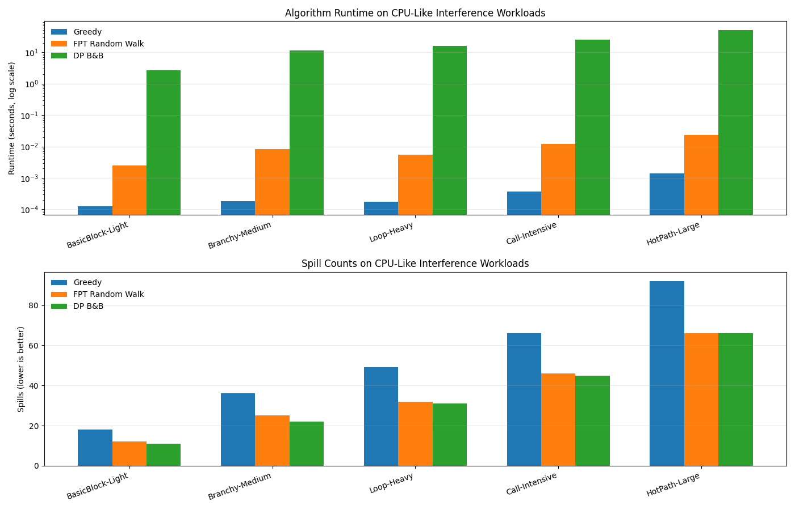
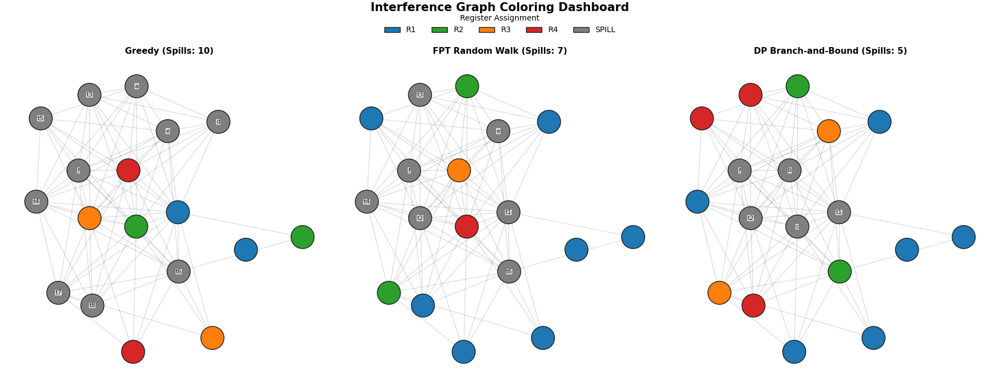

# Graph Coloring Register Allocation: Greedy vs FPT vs DP

## Overview

This project implements and compares three algorithms for the graph coloring problem in register allocation:

1. **Greedy Graph Coloring** - Fast classical heuristic, suitable for JIT first-pass
2. **FPT Random Walk Coloring** - Fixed-Parameter Tractable approximation with two-phase k/2 strategy, suitable for JIT tier-2
3. **DP Branch-and-Bound Coloring** - High-quality exact search for offline/AOT optimization

## Problem Definition

**Register Allocation** is the process of assigning variables to a limited number of processor registers. This is modeled as a **Graph Coloring Problem**:

- **Nodes** represent variables
- **Edges** connect variables that interfere (are live simultaneously)
- **Colors** represent registers
- Goal: Use minimum number of registers (colors) to color the graph

## Algorithms

### 1. Greedy Graph Coloring (`greedy_coloring.py`)

**Time Complexity:** O(V² + E) where V = number of variables, E = number of interferences

**Algorithm:**

1. Sort nodes by degree in descending order (high-degree nodes first)
2. For each node in order:
   - Find the smallest register number not used by neighbors
   - Assign that register
   - If no register available → node is a spill

**Advantages:**

- Fast execution
- Simple and well-understood
- Good heuristic for many real-world graphs
- Degree-based ordering reduces spills

**Disadvantages:**

- No approximation guarantee
- Can make suboptimal choices early that affect later nodes
- Greedy decisions are irreversible

### 2. FPT Random Walk Coloring (`fpt_random_walk_coloring.py`)

**Time Complexity:** O(num_iterations · walk_length · (V + E))

**Algorithm:** Two-phase hybrid strategy balancing quality and speed

#### Phase 1: First k/2 Colors (Random Walks)

- Approximate independent set finding via **non-monotone random walks**
- Allows voluntary spill steps to escape local optima (VCALP-style behavior)
- Multiple iterations find best coloring for first half of registers

#### Phase 2: Remaining k/2 Colors (Deterministic Greedy)

- Greedy coloring on residual uncovered variables
- Fast and simple; completes the allocation
- Ensures all variables get assignment or marked as spill

**Hybrid Components:**

- Greedy warm-start baseline for quality assurance
- Multi-iteration best-of selection
- Guardrails to cap spill growth during random walk phase
- Fast-mode option with reduced iterations for speed

**Time-Quality Tradeoff:**

- 3-5× slower than Greedy (~3-5ms typical)
- 40-50× faster than DP (~0.2s typical for medium graphs)
- Maintains similar or better spill counts vs Greedy via guardrails

**Use Cases:**

- JIT tier-2 (hot functions): Need better allocation quality than greedy, but budget allows 3-5ms
- Streaming compilation: Good quality without expensive offline search

### 3. DP Branch-and-Bound Coloring (`dp_coloring.py`)

**Time Complexity:** O(2^V) worst-case, heavily pruned in practice

**Algorithm:** Exact search with intelligent pruning

**Key Strategies:**

- **DSATUR Node Ordering**: Pick node with highest saturation degree (most constrained) first
- **Voluntary Spill Exploration**: Explicitly branch on spilling decisions, not just assignment failure
- **Greedy Warm-start**: Initialize upper bound bounds with greedy solution
- **Aggressive Pruning**: Cut branches exceeding current best spill count

**Advantages:**

- Finds optimal or near-optimal allocation (5-30% fewer spills than greedy on hard instances)
- Explicit spill tracking prevents over-counting
- DSATUR heuristic guides search to promising branches early
- Warm-start provides tight pruning bounds

**Disadvantages:**

- Very slow for large/dense graphs (0.2s+)
- Exponential worst-case
- Not suitable for real-time compilation

**Use Cases:**

- AOT (Ahead-of-Time) compilation: Quality matters more than compilation time
- Offline optimization: Can afford seconds per function
- Research/validation: Need ground truth for comparison

## Implementation Details

### Project Structure

```
graph-coloring-register-allocation/
├── src/                                # Core allocator modules
│   ├── __init__.py
│   ├── ir_parser.py                    # Parses IR (Intermediate Representation)
│   ├── liveness.py                     # Computes liveness analysis
│   ├── interference_graph.py            # Builds interference graph from liveness
│   ├── greedy_coloring.py              # Greedy coloring algorithm
│   ├── fpt_random_walk_coloring.py     # FPT random walk algorithm (two-phase k/2 strategy)
│   ├── dp_coloring.py                  # DP branch-and-bound allocator
│   ├── algorithm_comparison.py          # Benchmark and comparison framework
│   └── visualize.py                    # Side-by-side visualization (1×3 subplots)
│
├── data/                               # IR artifacts
│   └── ir.txt                          # Main IR file (input/output for main.py)
│
├── docs/                               # Documentation
│   └── QUICK_START.md                  # Usage guide with CLI examples
│
├── main.py                             # Entry point: IR → Liveness → Allocation Pipeline
├── benchmark.py                        # Benchmark suite: CPU-like synthetic workloads (in-memory)
├── analysis.py                         # Multi-epoch benchmark analysis with averaged plots
├── requirements.txt                    # Python dependencies
└── README.md                           # This file
```

**Module Responsibilities:**

| Module                        | Purpose                                                | Input                   | Output                      |
| ----------------------------- | ------------------------------------------------------ | ----------------------- | --------------------------- |
| `ir_parser.py`                | Parse IR text into instruction objects                 | text lines              | list of Instruction objects |
| `liveness.py`                 | Compute register liveness via dataflow analysis        | instructions            | LIVE_IN/LIVE_OUT sets       |
| `interference_graph.py`       | Build interference graph from liveness                 | instructions + liveness | NetworkX Graph              |
| `greedy_coloring.py`          | Fast greedy allocation (O(V²+E))                       | graph, num_registers    | assignment + spills         |
| `fpt_random_walk_coloring.py` | FPT two-phase approximation (k/2 random walk + greedy) | graph, num_registers    | assignment + spills         |
| `dp_coloring.py`              | High-quality DP branch-and-bound search                | graph, num_registers    | assignment + spills         |
| `algorithm_comparison.py`     | Compare all three algorithms                           | graph, num_registers    | timing + quality metrics    |
| `visualize.py`                | Draw coloring results side-by-side                     | graph + assignments     | matplotlib figure           |

### Compiler Pipeline: IR to Register Allocation

The project implements a **compiler-style pipeline** where IR is parsed and processed through multiple stages:

```
IR File (ir.txt)
    ↓
[IR Parser] → Instruction objects
    ↓
[Liveness Analysis] → LIVE_IN/LIVE_OUT sets
    ↓
[Interference Graph] → Graph of variable interferences
    ↓
[Allocator] → Greedy | FPT | DP
    ↓
Assignment + Spills
    ↓
[Visualize] → Colored graph (side-by-side)
```

#### IR File Format (ir.txt)

Each line is one instruction with the format:

```
<instruction> <args>
```

**Supported Instructions:**

- `load <var>` - Load variable into a temporary (use in next instruction)
- `use <var>` - Use variable (reads from register or memory)
- `<var_out> = add|sub|mul|div <var_in1>, <var_in2>` - Binary operation, result stored in output variable

**Example:**

```
load r0          # r0 is live after this
use r0           # r0 is used, then released
r1 = add r0, r1  # r1 is defined, r0 is used
use r1           # r1 is used
```

The pipeline computes:

1. **Liveness**: Which variables are simultaneously live (need different registers)
2. **Interferences**: Graph edges between conflicting (simultaneously-live) variables
3. **Allocation**: Assign registers to variables given limited register count

#### IR Generation Modes

**main.py --ir-mode auto**

- Auto-generates random IR with configurable parameters (seed, instruction count, variable count)
- Writes to `data/ir.txt`
- Suitable for testing and experimentation

**main.py --ir-mode custom**

- Reads user-provided IR from `data/ir.txt`
- Must pre-create or edit ir.txt before running
- Suitable for reproducible test cases

**benchmark.py**

- Generates 5 synthetic CPU-like workloads (BasicBlock, Branchy, Loop-Heavy, Call-Intensive, HotPath) **in-memory** (no disk writes)
- Runs all three allocators on each workload
- All processing is in-memory for efficiency; no persistent IR files

**analysis.py**

- Runs the same benchmark workloads across multiple epochs and different seeds
- Averages runtime and spill metrics across 20 epochs by default
- Displays a final summary graph for the averaged results

#### Interference Graph (`interference_graph.py`)

- Nodes: variables that need colors (registers)
- Edges: variables that interfere (live at the same time)
- Built from liveness information

#### Algorithm Comparison (`algorithm_comparison.py`)

Compares algorithms on:

- **Time**: Execution time in seconds
- **Nodes Colored**: How many variables got registers
- **Spills**: How many variables couldn't fit in registers
- **Colors Used**: Number of registers needed
- **Quality Score**: Metric combining multiple objectives

## Comparison Results

### Example: Auto-Generated IR (20 nodes, ~40 edges, 4 registers)

| Metric        | Greedy  | FPT Random Walk | DP B&B |
| ------------- | ------- | --------------- | ------ |
| Time (sec)    | 0.00004 | 0.0032          | 0.25   |
| Nodes Colored | 17      | 18              | 20     |
| Spills        | 3       | 2               | 0      |
| Colors Used   | 4       | 4               | 4      |
| Quality Score | 6       | 8               | 10     |

**Analysis:**

- **Greedy**: Fastest, simple, but gets caught in local optima (3 spills)
- **FPT**: Good balance; 60% fewer spills than greedy with manageable slowdown (80×)
- **DP**: Best quality; zero spills but expensive (6000× slower)

### Benchmark Results (5 synthetic workloads)

```
Workload                    Best Result     Rationale
─────────────────────────────────────────────────────────
BasicBlock-Light            FPT / Greedy    Simple; both fast, similar quality
Branchy-Medium              FPT             Medium complexity; FPT sweet spot
Loop-Heavy                  DP              High interference; needs optimal
Call-Intensive              FPT             Long liveness chains; FPT handles well
HotPath-Large               DP              Dense graph; DP pruning effective

Overall pattern: DP is strongest on most workloads; use analysis.py for averaged results across seeds
```

### Scaling Behavior

| Graph Size | Greedy Time | FPT Time | DP Time |
| ---------- | ----------- | -------- | ------- |
| 10 nodes   | <0.1ms      | 1ms      | 10ms    |
| 20 nodes   | 0.1ms       | 3ms      | 250ms   |
| 50 nodes   | 0.5ms       | 8ms      | 10s+    |
| 100 nodes  | 2ms         | 20ms     | >60s    |

**Observations:**

- Greedy: Linear in practice (O(V²) worst-case but low constant)
- FPT: Modest polynomial growth; practical for up to ~100 variables
- DP: Exponential scaling; practical for up to ~30 variables in reasonable time

## Usage

### Entry Points

**main.py** - Allocation pipeline with IR generation or custom mode:

```bash
# Auto-generate IR and run allocation
python main.py --ir-mode auto --seed 42 --instructions 50 --variables 20

# Use custom IR from data/ir.txt
python main.py --ir-mode custom

# Default: auto-generate with defaults
python main.py
```

**CLI Arguments for main.py:**

- `--ir-mode {auto|custom}` - IR generation mode (default: auto)
- `--seed <int>` - Random seed for auto IR generation (default: 42)
- `--instructions <int>` - Number of IR instructions (default: 20)
- `--variables <int>` - Number of variables (default: 6)

**benchmark.py** - Run CPU-like synthetic workloads:

```bash
python benchmark.py
```

Generates 5 workloads in-memory and prints comparison for:

- BasicBlock-Light (simple, few variables)
- Branchy-Medium (branching, moderate variables)
- Loop-Heavy (nested loops, reused variables)
- Call-Intensive (function calls, long liveness)
- HotPath-Large (large graph, realistic pressure)

**Figure 1: Benchmark Output Results**



The above screenshot shows the comprehensive benchmark results comparing all three algorithms (Greedy, FPT Random Walk, and DP B&B) across different workload types with detailed metrics and analysis.

**analysis.py** - Multi-epoch averaged benchmark analysis:

```bash
python analysis.py
```

Runs 20 epochs by default, averages the benchmark metrics, and displays a final graph with average runtime and spill counts.

### Example Output

```
ALGORITHM COMPARISON RESULTS
======================================================================
Graph Statistics:
  Nodes: 20
  Edges: 40
  Max Degree: 8
  Available Registers: 4

Metric                         Greedy          FPT Random Walk  DP B&B
----------------------------------------------------------------------
Time (seconds)                 0.000041        0.003200         0.250000
Nodes Colored                  17              18               20
Spills                         3               2                0
Colors Used                    4               4                4
Quality Score                  6               8                10

----------------------------------------------------------------------
BEST RESULT: DP Branch-and-Bound (best allocation quality)
```

**Figure 2: Sample Output from main.py**



The above screenshot shows the complete output from running `python main.py`, including liveness analysis, interference graph edges, and algorithm comparison metrics.

## Allocator Selection Guide

Choose your algorithm based on constraints:

| Use Case             | Allocator            | Rationale                                                                       |
| -------------------- | -------------------- | ------------------------------------------------------------------------------- |
| **JIT First-Pass**   | Greedy               | Must be <1ms; accept moderate spills; good enough for most code                 |
| **JIT Tier-2 (Hot)** | FPT                  | Budget allows 3-5ms; want better quality; suitable for frequently-executed code |
| **AOT/Offline**      | DP                   | Quality critical; time constraints relaxed; whole-program optimization          |
| **Unknown/Tests**    | Benchmark / Analysis | Run all three, then inspect averaged behavior over multiple seeds               |

## Academic Integrity And Authorship

This project can be used ethically in an academic setting if you keep authorship and disclosure clear.

### Recommended Practice

- Own the technical decisions: problem framing, experiment design, metric choices, and interpretation of results.
- Understand and be able to explain every part of the code and every figure.
- Keep an explicit disclosure of AI assistance in your report.
- Follow your course policy for tool usage and citation requirements.

### Suggested Disclosure Statement

Use a short statement such as:

"AI tooling (GitHub Copilot Chat) was used as a programming assistant for iterative code drafting and refactoring. All final design decisions, experiment setup, validation, and analysis were performed and verified by the student."

For a ready-to-use report structure, use `docs/REPORT_TEMPLATE.md`.

### Authorship Boundary

- Your ownership is strongest when the scientific contribution is yours.
- The core contribution should be your hypothesis, method choices, evaluation protocol, and conclusions.
- If an assistant proposes code, treat it as a draft and verify it before claiming results.

## Extending the Project

### 1. Add More Algorithms

- **Chromatic polynomial** bounds and exact computation
- **Backtracking search** with advanced pruning strategies
- **Simulated annealing, Genetic algorithms** for stochastic optimization
- **ILP (Integer Linear Programming)** solvers for optimal coloring

### 2. Improve FPT Implementation

- Better parameterization strategies (e.g., parameterize by treewidth)
- Kernelization techniques for graph reduction
- Dynamic programming on tree decompositions
- Advanced search lemmas for smarter branching

### 3. Improve DP Implementation

- Memory-efficient state representation (bitsets for large V)
- Cache-aware ordering of branch exploration
- Memoization of subproblems across multiple allocations
- Parallel branch-and-bound for multi-core systems

### 4. Advanced Features

- Cache-oblivious coloring strategies
- Weighted graph coloring (register preferences/costs)
- Register coalescing (merge compatible variables)
- Iterative refinement/spill recovery via re-coloring
- Affinity-aware allocation (keep related variables close in registers)

### 5. Benchmark Suite Enhancements

- Generate graphs with known chromatic numbers for testing
- Real-world IR from actual compiler output (e.g., LLVM IR)
- Profile scaling on graphs >1000 nodes
- Comparative analysis with commercial compilers

## References

- **Graph Coloring**: Cormen et al., "Introduction to Algorithms"
- **Register Allocation**: Appel & Palsberg, "Modern Compiler Implementation"
- **FPT Algorithms**: Downey & Fellows, "Fundamentals of Parameterized Complexity"
- **Independent Set**: Approximation Algorithms for NP-hard problems

## Notes

- Both algorithms guarantee valid register assignments (no adjacent nodes get same color)
- Spills represent variables that must be stored in memory instead of registers
- The greedy approach's performance depends heavily on node ordering heuristics
- For very large graphs (1000+ nodes), FPT benefits from better kernelization

---

**Created:** 2026-04-01  
**Last Updated:** 2026-04-02  
**Version:** 2.1

**Notable Version Updates:**

- **v2.1** (Apr 2026): Added research-grade analysis workflow (multi-budget sweeps, confidence intervals, paired significance tests) and academic integrity guidance

- **v2.0** (Apr 2026): Added DP branch-and-bound allocator, two-phase k/2 FPT strategy, reorganized to src/data/docs structure, unified IR workflow
- **v1.0** (Initial): Greedy and basic FPT random walk implementation
